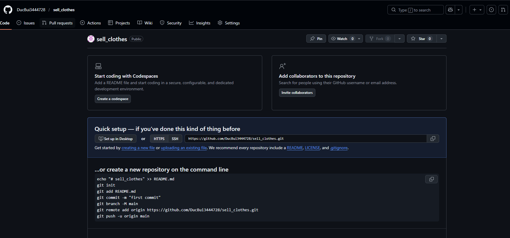
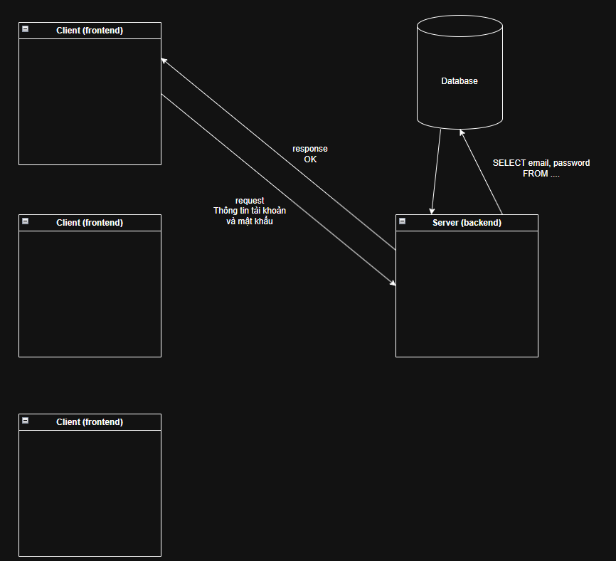

# Readme.md

Chú ý `.md` là file Markdown dùng để viết tài liệu dự án 

Cách dùng https://github.com/CUNGVANTHANG/Markdown-syntax

# Technical

Website có 2 loại hay dùng nhất

- Code:

+ Frontend: ReactJS, NextJS, VueJS, Angular, Flutter, HTML/CSS/JS...

+ Backend: NodeJS, NestJS, Java Spring Boot, Python Django, Python FastAPI, PHP Laravel...

+ Database: MySQL, PostgreSQL, MongoDB, Firebase, Supabase, OracleSQL, SQL Server...

- CMS: Wordpress (kéo thả thay vì phải code, phù hợp với website nhỏ không quá lớn)

App mobile

- Code:

+ Frontend (UI): React Native, Flutter, Swift, Kotlin, Java...

+ Backend (Logic): NodeJS, NestJS, Java Spring Boot, Python Django, Python FastAPI, PHP Laravel...

+ Database: MySQL, PostgreSQL, MongoDB, Firebase, Supabase, OracleSQL, SQL Server...

# Editor

VSCode (Nhẹ, dễ dùng)

BlueJ

IntelliJ IDEA

NetBeans

Visual Studio

Eclipse

Antigravity

Cursor

Android Studio

XCode

Chỉ là 1 phần mềm edit code (công cụ). Thế nên sử dụng phần mềm nào cũng được. 


# Tech Stack

- **Frontend**: React
- **Backend**: Node.js
- **Database**: MySQL
- **Styling**: Tailwind CSS

Frontend: React

Thư viện JavaScript dùng để xây dựng UI theo mô hình component

Chạy trên trình duyệt

Render giao diện dựa trên Virtual DOM → tối ưu hiệu năng cập nhật UI

Logic hiển thị và trạng thái được quản lý trong component (state, props)

Backend: Node.js

Runtime cho phép chạy JavaScript phía server

Dựa trên V8 engine

Mô hình event-driven, non-blocking I/O

Phù hợp cho API, real-time system, microservices

API là gì?

API (Application Programming Interface) là một tập hợp các quy tắc, định nghĩa và giao thức cho phép các ứng dụng phần mềm khác nhau giao tiếp với nhau.

Nó hoạt động như một "người trung gian" cho phép hai ứng dụng trao đổi dữ liệu và chức năng mà không cần biết chi tiết về cách thức hoạt động bên trong của nhau.

# Bước 1: Cài đặt Node.js

- Tải về và cài đặt Node.js từ trang chủ: https://nodejs.org/

# Bước 2: Cài đặt MySQL

- Tải về và cài đặt MySQL từ trang chủ: https://dev.mysql.com/downloads/

# Bước 3: Cài đặt Tailwind CSS

- Tải về và cài đặt Tailwind CSS từ trang chủ: https://tailwindcss.com/docs/installation

Tailwind CSS là một framework CSS giúp bạn xây dựng giao diện web nhanh chóng và dễ dàng.

Chú ý: Phân biệt Framework và Library

- Library

Tập hợp các hàm / class được thiết kế để được gọi.

Code của bạn kiểm soát luồng thực thi (control flow).

Library không áp đặt cấu trúc cho toàn bộ ứng dụng

- Framework

Một bộ khung ứng dụng hoàn chỉnh.

Framework kiểm soát luồng thực thi.

Code của bạn chỉ được viết vào những điểm mà framework cho phép (hooks, callbacks, lifecycle methods).

# Bước 4: Cài đặt React Vite

```
cd frontend
npm create vite .
```

```
y
React
TypeScript
No
Yes
```

> Thư viện nằm trong thư mục node_modules

# Bước 5: Chạy chương trình frontend

Mở terminal lên

Cách 1: Crtl + `

Cách 2: Trên menu chọn Terminal → New Terminal

Cách chạy dự án frontend

```
cd frontend
npm run dev
```

Cách dừng chương trình frontend. Chọn vào terminal và nhấn:

```
Ctrl + C
```

Chú ý: http://localhost:5173/login sẽ cho biết đang ở trang nào thông qua /pages

Cách để test trên điện thoại sử dụng Inspect

Vào website, chuột phải + inspect + chọn device


# Làm việc với git khi mới tạo dự án

Tạo project trên github:



```
git init
```

Reinitialized existing Git repository in C:/Users/user/Desktop/study/sell_clothes/.git/

```
git add .
```

```
git commit -m "Initial commit"
```

Khi mới tạo dự án thì sẽ phải 

```
git branch -M main
git remote add origin https://github.com/DucBui3444728/sell_clothes.git
git push -u origin main
```

Enumerating objects: 40, done.
Counting objects: 100% (40/40), done.
Delta compression using up to 16 threads
Compressing objects: 100% (36/36), done.
Writing objects: 100% (40/40), 131.08 KiB | 6.90 MiB/s, done.
Total 40 (delta 6), reused 0 (delta 0), pack-reused 0 (from 0)
remote: Resolving deltas: 100% (6/6), done.
To https://github.com/DucBui3444728/sell_clothes.git
 * [new branch]      main -> main
branch 'main' set up to track 'origin/main'.

Đã đẩy lên thành công

# Làm việc với git khi đã có dự án

Cách tạo nhánh (branch) để làm việc

```
git checkout -b feature/ui
```

Đẩy code lên github

```
git add .
git commit -m "feature/ui"
git push
```

PS C:\Users\user\Desktop\study\sell_clothes> git push
fatal: The current branch feature/ui has no upstream branch.
To push the current branch and set the remote as upstream, use

    git push --set-upstream origin feature/ui

To have this happen automatically for branches without a tracking
upstream, see 'push.autoSetupRemote' in 'git help config'.

Thì copy `git push --set-upstream origin feature/ui`

# Deploy frontend lên vercel miễn phí

Bằng cách tạo tài khoản vercel (đăng nhập bằng google) sau đó liên kết với github của mình

Khi đó mình có thể lựa chọn project front end mình muốn deploy (Cực kỳ đơn giản)

# Merge code từ nhánh feature/ui --> main

Lên github vào nhánh feature/ui


Sẽ chọn open full request


Xong sẽ chọn Create Full Request

Nguyên tắc hoạt động deploy là mình sẽ build project (chạy 1 lệnh để đưa tất các code thành 1 file duy nhất)

```
cd frontend
npm run build
```

Tạo 2 thư mục dist (build) chứa project đã build của mình. Có nghĩa phải build thành công thì mới deploy được

# Backend

NodeJS + MySQL (Xampp)

Ta thấy ở front end và back end có 1 file package.json. File này dùng để ghi những thư viện đang sử dụng

Viết code theo kiến trúc Client Server

Có nghĩa Client và Server sẽ giao tiếp với nhau thông qua API

Code backend theo kiến trúc MVC (model - view - controller)

Model: Đại diện cho dữ liệu và quy tắc nghiệp vụ của ứng dụng. Model xử lý tất cả các thao tác liên quan đến dữ liệu, bao gồm lưu trữ, truy xuất và cập nhật dữ liệu. Đây là phần back-end của ứng dụng, nơi chứa tất cả logic dữ liệu. 

View: Chịu trách nhiệm hiển thị dữ liệu cho người dùng. View là giao diện người dùng, nơi người dùng tương tác với ứng dụng. Nó thường được xây dựng bằng các ngôn ngữ template như HTML, JSP hoặc React. 

Controller: Là cầu nối giữa Model và View. Controller nhận các yêu cầu từ người dùng, xử lý chúng và cập nhật Model, sau đó chọn View phù hợp để hiển thị kết quả.

Thư mục routes chứa các endpoint 

# Luồng xử lý backend, frontend



# File `.env`

File này dùng để lưu các thông tin của hệ thống, thường các thông tin nhạy cảm như mật khẩu, ...

# Dịch vụ bên thứ ba? 

Ứng dụng của mình sử dụng chức năng, thông tin lấy từ ứng dụng khác (thì ứng dụng khác này được gọi là dịch bên thứ 3)

Ví dụ: Làm chức năng đăng nhập với Gooogle (Sử dụng dịch vụ đăng nhập của google)

# Chạy backend

```
cd backend
npm run dev
```

Backend đang triển khai theo mô hình MVC (Model - View - Controller). Ngoài mô hình MVC này ra còn có MVP

# Trong quá trình dev thì nó có những công cụ hỗ trợ trong việc dev

Điển hình là công cụ tự động build khi code thay đổi

Công cụ mình đang dùng ở nodejs là nodemon

# Trong software engineer có 3 kiểu code khác nhau hoàn toàn về cách hoạt động:

- Kiểu 1: Code frontend + backend trong 1 thư mục (monolithic)
- Kiểu 2: Code frontend 1 thư mục, backend 1 thư mục (monolithic)
- Kiểu 3: Code frontend nhiều thư mục, backend nhiều thư mục (microservices)

Hiện tại bài mình đang làm là kiểu 2. Đối với kiểu 2 thì

Frontend bây giờ đóng vai trò như 1 ứng dụng

Backend bây giờ đóng vai trò như 1 ứng dụng 

2 ứng dụng riêng biệt, 2 ứng dụng giao tiếp với nhau thông API dựa trên mobile client - server

Deploy là gì?

Deploy đơn giản là đẩy ứng dụng lên môi trường người dùng thật

Môi trường dev, môi trường production, môi trường test....